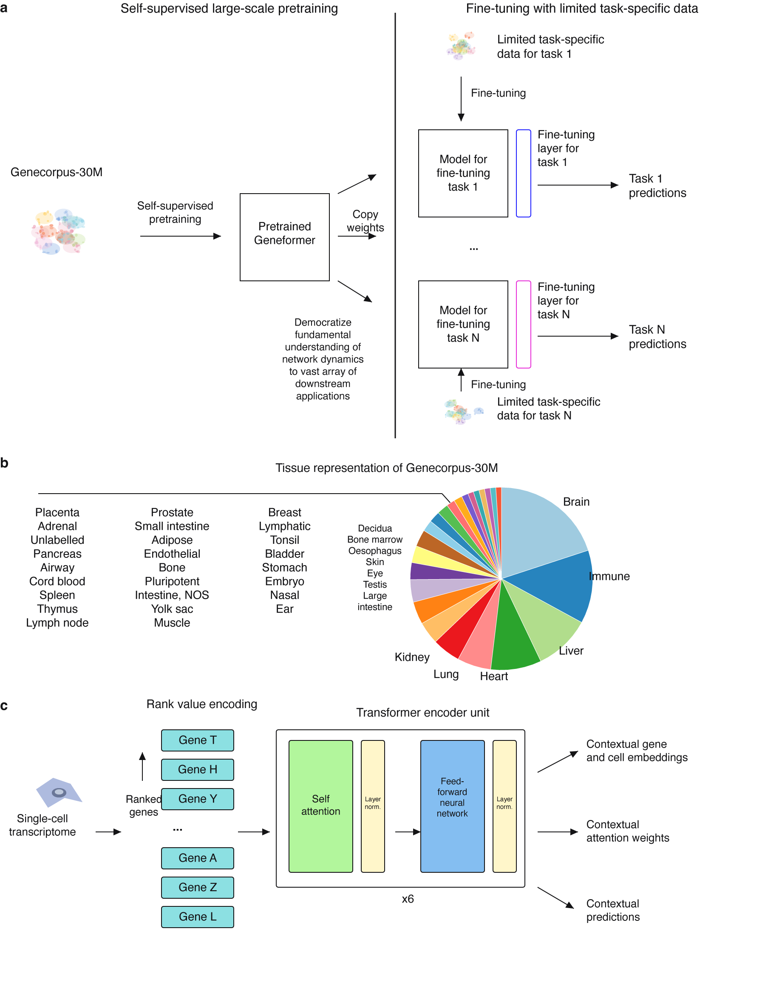
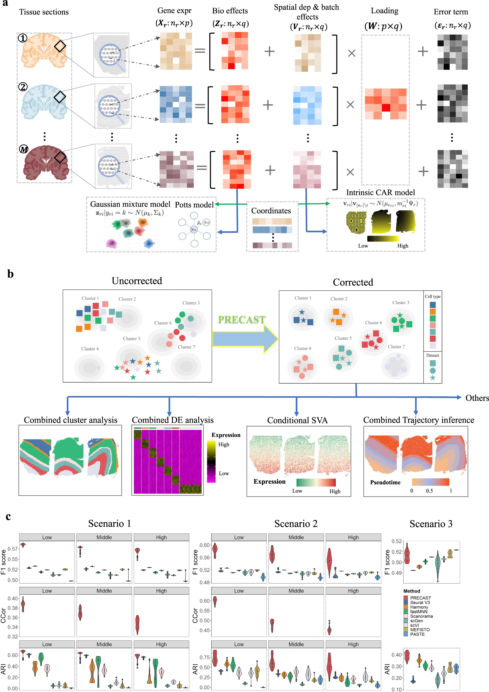
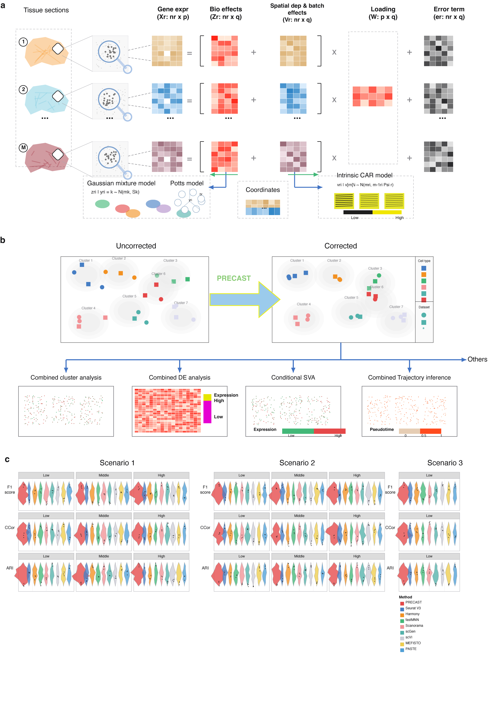

# Illustrator MCP for Codex

Control Adobe Illustrator from Codex with a tiny local MCP server.

This project is designed for one practical workflow: ask an image model to make a clean high-resolution reference figure, give that PNG to Codex, and let Codex rebuild it in Illustrator as an editable vector deliverable.

The MCP server is intentionally small and dependency-free. It runs on macOS, talks to Illustrator through AppleScript, and exposes a few tools for running ExtendScript, inspecting the active document, and editing selected objects.

## Why This Exists

Scientific and technical figures often start as raster screenshots, AI-generated mockups, or paper figures that are hard to edit. Codex can use this MCP server to:

- create new Illustrator documents;
- draw vector boxes, arrows, heatmaps, plots, legends, and labels;
- search for vector-style replacements for raster assets when appropriate;
- save editable Illustrator working files locally and export reviewable `.png` previews;
- iterate until text, arrows, borders, and figure panels are production-ready.

## Suggested Workflow

1. Generate or collect a high-quality reference image.
   Use GPT Image / GPT Image 2 if available, or the latest image generation model in your tool.

2. Send the reference PNG to Codex.
   Ask Codex to reproduce it in Illustrator using this MCP server.

3. Ask Codex to replace raster details with vector equivalents.
   For example, use simple drawn organs, icons, UMAP-like clusters, heatmaps, violin plots, flow arrows, legends, and diagrams instead of embedding low-resolution PNG fragments.

4. Require a final deliverable pass.
   Codex should export a `.png` preview, inspect it, and fix overlaps before delivery. If you need an editable working file, ask Codex to save it locally; this repository only ships PNG previews and generation scripts for examples.

## Examples

The example gallery is intentionally PNG-only. Editable `.ai` files are not committed to the repository.

### Geneformer-style Workflow Figure

Reference paper: [Transfer learning enables predictions in network biology](https://www.nature.com/articles/s41586-023-06139-9). The source article is under exclusive Springer Nature rights, so this repository cites the paper instead of redistributing the original panel PNG.

Recreated in Illustrator:



Files:

- [`examples/geneformer/recreated.png`](examples/geneformer/recreated.png)
- [`examples/geneformer/draw_geneformer_recreated.jsx`](examples/geneformer/draw_geneformer_recreated.jsx)

### PRECAST-style Method Figure

Reference paper: [Probabilistic embedding, clustering, and alignment for integrating spatial transcriptomics data with PRECAST](https://www.nature.com/articles/s41467-023-35947-w). The PRECAST article is CC BY 4.0, so the reference PNG is included with attribution.

Original PNG:



Recreated in Illustrator:



Files:

- [`examples/precast/original.png`](examples/precast/original.png)
- [`examples/precast/recreated.png`](examples/precast/recreated.png)
- [`examples/precast/draw_precast_recreated.jsx`](examples/precast/draw_precast_recreated.jsx)

## Install

This MCP server currently supports macOS with Adobe Illustrator installed locally.

```bash
mkdir -p ~/code/mcp
git clone https://github.com/YOUR_USERNAME/illustrator-mcp-for-codex.git ~/code/mcp/illustrator-mcp-for-codex
chmod +x ~/code/mcp/illustrator-mcp-for-codex/illustrator_mcp.py
```

Open Adobe Illustrator once before using the server. macOS may ask for Automation permission the first time Codex controls Illustrator.

## Codex Configuration

Add this to `~/.codex/config.toml`:

```toml
[mcp_servers.illustrator]
command = "python3"
args = [
  "/Users/YOUR_USERNAME/code/mcp/illustrator-mcp-for-codex/illustrator_mcp.py"
]
env = { ILLUSTRATOR_APP_ID = "com.adobe.illustrator" }
```

Restart Codex after editing the config.

The default bundle id is `com.adobe.illustrator`, which works across recent versioned Illustrator app names such as Adobe Illustrator 2025. If needed, set `ILLUSTRATOR_APP_ID` or `ILLUSTRATOR_APP` in the environment.

## Available MCP Tools

- `illustrator_eval_js`: run ExtendScript JavaScript in Adobe Illustrator.
- `illustrator_document_info`: inspect the active document.
- `illustrator_set_selection_fill`: set RGB fill for selected items.
- `illustrator_set_selection_stroke`: set RGB stroke and optional stroke width for selected items.

## Smoke Test

This verifies that the server speaks MCP JSON-RPC. It does not require Illustrator:

```bash
printf '{"jsonrpc":"2.0","id":1,"method":"initialize","params":{"protocolVersion":"2024-11-05","capabilities":{},"clientInfo":{"name":"test","version":"0"}}}\n{"jsonrpc":"2.0","method":"notifications/initialized","params":{}}\n{"jsonrpc":"2.0","id":2,"method":"tools/list","params":{}}\n' | python3 illustrator_mcp.py
```

## Recommended Prompt

Use this when asking Codex to recreate a figure:

```text
Use the Illustrator MCP to recreate this reference figure as an editable Illustrator document.

Requirements:
- Rebuild the figure with vector shapes wherever possible.
- Do not simply embed the original PNG as the final result.
- You may search the web for vector-style assets or draw simplified replacements for raster details.
- Preserve the overall panel structure, hierarchy, colors, and visual meaning.
- Use fixed text boxes and generous margins.
- Text must not overlap with other text, arrows, borders, icons, plots, or panel frames.
- Arrows must be aligned, visually intentional, and must not run through labels or important shapes.
- Keep formulas and labels legible. If a long label would collide, shorten it or add a line break.
- Export a `.png` preview. Save the editable Illustrator file locally only if requested.
- Inspect the exported PNG before final delivery and iterate until it is clean enough to hand off.
```

More prompt templates are in [`prompts/`](prompts/).

## Notes for Figure Reproduction

- Prefer drawing native Illustrator shapes over embedding raster crops.
- Keep dense panels on a grid.
- Use named helper functions for rectangles, arrows, labels, heatmaps, legends, and plots.
- Export a PNG after each major layout pass and visually inspect it.
- If Illustrator hangs while exporting a complex figure, split the work into two steps: draw/save first, then export PNG from the active document.

## References

- Theodoris, C.V., Xiao, L., Chopra, A. et al. [Transfer learning enables predictions in network biology](https://doi.org/10.1038/s41586-023-06139-9). Nature 618, 616-624 (2023).
- Liu, W., Liao, X., Luo, Z. et al. [Probabilistic embedding, clustering, and alignment for integrating spatial transcriptomics data with PRECAST](https://doi.org/10.1038/s41467-023-35947-w). Nat Commun 14, 296 (2023). The article is licensed under [CC BY 4.0](http://creativecommons.org/licenses/by/4.0/).

## macOS Permissions

If Illustrator does not respond, check:

`System Settings -> Privacy & Security -> Automation`

Allow your MCP client, terminal, or Codex host process to control Adobe Illustrator.

## License

MIT
